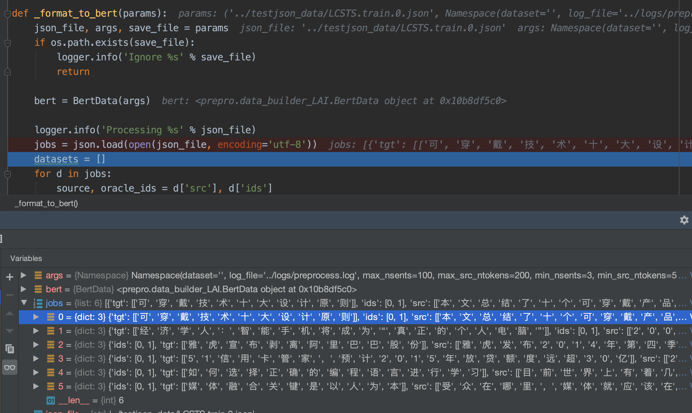
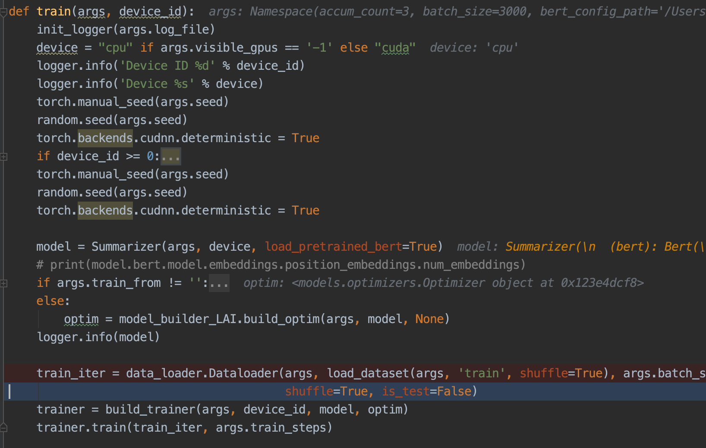

# BERTSUM中文数据实验说明

bertsum 抽取式，中文模型

---

# 1. 数据输入的处理

## 1.1 输入json文本到可直接加载pt文本的转化

字单位的json，包含 `标题（可无，这里是抽取式摘要，没用到）`、`（分割句子的）正文数组`、`关键句索引数字`。会在`data_builder_LAI.py  -> _format_to_bert` 中加载它

> [ {  'tgt':[],'ids':[],'src':[] },  {}  ,...,  {}  ]

- format_to_bert，批量给json文件数据，以包含train、test关键字的作文训练、测试数据，保存的二进制文件名为直接替换 `.json`后的 `bert.pt`文件

  > pool = Pool(args.n_cpus) 可以多线程处理

## 1.2 转换数据后的保存

在`_format_to_bert -> BertData.preprocess`中，会把json中的每一个解析的item  `d`，加工成可训练的数字数据：`indexed_tokens, labels, segments_ids, cls_ids, src_txt `，被以字典形式保存它，一整个json的多个文本item放入`datasets`列表，保存的最终的`xx.bert.pt`，就是对应json文件的全部处理后的信息，是个大列表 包含多个dict

>LCSTS.test.0.json  >>  LCSTS.test.0.bert.pt
>LCSTS.train.0.json >> LCSTS.train.0.bert.pt

---

# 2. 数据到模型的过程

## 2.1 train中数据的流动

会在`data_loader.Dataloader -> __iter__ ` 进行最终的训练批次数据返回

`data_loader.py ->  load_dataset`中加载之前`1.2`保存的xx.pt文件，上面`1.2`保存的`datasets`，根据corpus_type 只加载包含对应关键词的文件

